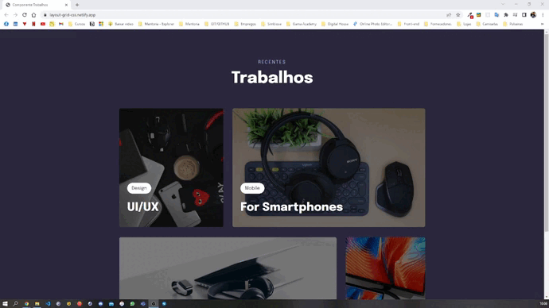

<h1 align="center">
  Layout-com-grid

</h1>

<h2 align="center" >Descrição do Projeto</h2>

  Esse Layout responsivo em display Grid é o 5° projeto realizado do programa Explorer da Rockeseat.

 

   

          Projeto tem como principal objetivo a criação de uma página totalmente responsiva com animações ao entra na pagina e ao passar o mouse sobre as imagens, sendo que as mesmas imagens estão organizadas com o layout grid.
  

  
  
 
    
  
 
    
   
  
  ## 📖 Conceitos e técnicas aprendidas.

- [x] Animações com CSS com as propriedades (animation e @keyframes).
- [x] Transições e transformações no CSS com as propriedades (transition e transform).
- [x] Adicionando filtros em imagens com CSS (filter)
- [x] CSS Grid
  
## 🔗 Link da aplicação no ar: https://layout-grid-css.netlify.app/
  
## :rocket: Tecnologias

Esse projeto foi desenvolvido com as seguintes tecnologias:

✔️ HTML

✔️ CSS

✔️ Layout Grid

✔️ Layout Responsivo
